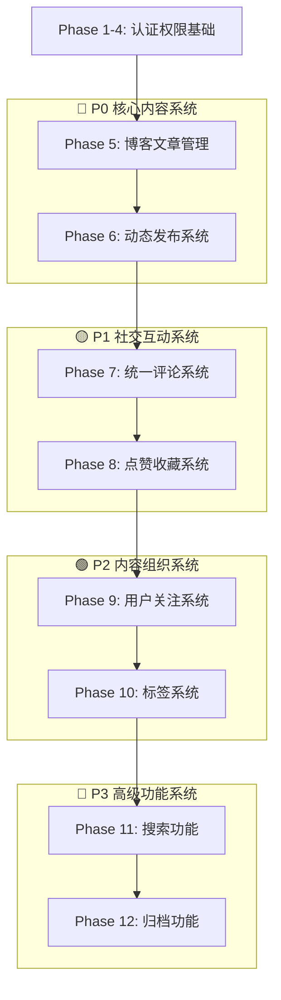

# 现代化博客系统 - 设计依赖图

**文档版本**: v1.0  
**制定日期**: 2025-08-25  
**对应文档**: 《系统模块设计顺序.md》

## 🏊‍♂️ 模块依赖泳道图

```mermaid
gantt
    title 现代化博客系统模块实施依赖图
    dateFormat  X
    axisFormat %d

    section 🔴 P0-核心内容
    Phase 5 博客文章管理    :p5, 1, 7d
    Phase 6 动态发布系统     :p6, after p5, 5d

    section 🟡 P1-社交互动
    Phase 7 统一评论系统     :p7, after p6, 4d
    Phase 8 点赞收藏系统     :p8, after p7, 3d

    section 🟢 P2-内容组织
    Phase 9 用户关注系统     :p9, after p8, 4d
    Phase 10 标签系统       :p10, after p9, 4d

    section 🔵 P3-高级功能
    Phase 11 搜索功能      :p11, after p10, 5d
    Phase 12 归档功能      :p12, after p11, 3d
```



---

## 📋 依赖关系详细分析

### 🔗 强依赖关系 (必须顺序)

#### Phase 5 → Phase 6 (博客 → 动态)

**依赖原因**: 共享前端编辑组件和发布逻辑

- 富文本编辑器组件可复用
- 内容发布状态管理逻辑共享
- 权限验证模式一致
- **关键路径**: ✅ 必须串行

#### Phase 6 → Phase 7 (动态 → 评论)

**依赖原因**: 评论系统需要文章和动态作为载体

- Comment 多态关联需要 Post 和 Activity 模型
- 评论组件需要在文章和动态页面集成
- **关键路径**: ✅ 必须串行

#### Phase 7 → Phase 8 (评论 → 点赞收藏)

**依赖原因**: 共享用户互动逻辑和API模式

- 相似的多态关联设计模式
- 统一的用户权限验证逻辑
- 乐观UI更新模式复用
- **关键路径**: ✅ 必须串行

### 🔗 弱依赖关系 (可并行优化)

#### Phase 8 → Phase 9 (点赞收藏 → 关注)

**依赖原因**: 社交功能逻辑完整性

- 关注功能增强用户互动体验
- 共享用户发现和推荐逻辑
- **并行可能**: ⚡ 技术上可并行，但逻辑上建议串行

#### Phase 9 → Phase 10 (关注 → 标签)

**依赖原因**: 共享内容发现和搜索基础逻辑

- 用户发现页面可集成标签筛选
- 关注用户的内容可按标签分类
- **并行可能**: ⚡ 可考虑并行开发

#### Phase 10 → Phase 11 (标签 → 搜索)

**依赖原因**: 搜索功能需要标签作为过滤维度

- 标签是搜索的重要过滤条件
- 搜索结果需要标签信息展示
- **关键路径**: ✅ 必须串行

#### Phase 11 → Phase 12 (搜索 → 归档)

**依赖原因**: 归档功能集成搜索能力提升用户体验

- 归档页面可集成搜索功能
- 搜索结果可按时间维度过滤
- **并行可能**: ⚡ 归档功能相对独立，可考虑并行

---

## 🏗️ 技术依赖架构图



---

## 🎯 并行开发机会分析

### 💡 可并行开发的组合

#### 组合1: Phase 9 + Phase 10 (关注 + 标签)

**条件**: Phase 8 完成后 **优势**:

- 两个模块相对独立
- 可由不同开发者并行开发
- 节省 2-3 天开发时间

**风险**:

- 用户发现页面需要协调集成
- 可能需要额外的集成测试时间

#### 组合2: Phase 11 + Phase 12 (搜索 + 归档)

**条件**: Phase 10 完成后 **优势**:

- 归档功能相对简单独立
- 搜索功能集成点有限
- 节省 1-2 天开发时间

**风险**:

- 搜索结果时间过滤器需要协调
- 归档页面搜索集成需要沟通

### ⚠️ 不建议并行的组合

#### Phase 5 + Phase 6 (博客 + 动态)

**原因**: 共享核心组件和逻辑，并行开发容易冲突

#### Phase 7 + Phase 8 (评论 + 点赞)

**原因**: 紧密的用户互动逻辑耦合，需要协调设计

---

## 📊 资源分配建议

### 👥 单开发者模式 (推荐)

**优势**: 最小沟通成本，最佳代码一致性 **时间成本**: 约 6-8 周完整实施
**适用情况**: 个人项目或小团队

```
Week 1-2: Phase 5-6 (博客+动态核心)
Week 3-4: Phase 7-8 (社交互动完整)
Week 5-6: Phase 9-10 (内容组织)
Week 7-8: Phase 11-12 (高级功能) + 测试优化
```

### 👥👥 双开发者模式

**优势**: 适度加速，风险可控 **时间成本**: 约 4-5 周完整实施  
**分工建议**:

- **开发者A**: Phase 5,7,9,11 (核心业务逻辑)
- **开发者B**: Phase 6,8,10,12 (UI和辅助功能)

### 👥👥👥 三开发者模式 (不推荐)

**风险**: 沟通成本高，代码一致性难保证 **适用情况**: 仅在时间极度紧迫时考虑

---

## 🚨 关键风险点

### 🔴 高风险依赖点

#### Phase 5 → Phase 6 依赖风险

- **风险**: 富文本编辑器选型错误影响后续开发
- **缓解**: Phase 5 开始前确定编辑器技术选型
- **检查点**: 编辑器组件可复用性验证

#### Phase 10 → Phase 11 依赖风险

- **风险**: 标签搜索性能瓶颈影响用户体验
- **缓解**: Phase 10 实施时考虑搜索性能设计
- **检查点**: 标签查询性能基准测试

### 🟡 中等风险依赖点

#### Phase 7 → Phase 8 集成风险

- **风险**: 评论和点赞UI集成复杂度高
- **缓解**: 设计阶段统一考虑互动组件布局
- **检查点**: 互动组件设计评审

#### Phase 8 → Phase 9 性能风险

- **风险**: 社交功能增加数据库查询复杂度
- **缓解**: 关注功能实施时考虑查询优化
- **检查点**: 数据库查询性能测试

---

## 🎯 里程碑检查点

### Milestone 1: MVP Core (Phase 5-6 完成)

**验收标准**:

- [ ] 管理员可完整管理博客文章
- [ ] 用户可发布和查看动态
- [ ] 核心编辑组件稳定可复用
- [ ] 性能基准: 页面加载 < 2秒

### Milestone 2: Social MVP (Phase 7-8 完成)

**验收标准**:

- [ ] 完整的用户互动功能 (评论+点赞+收藏)
- [ ] 乐观UI更新流畅运行
- [ ] 社交功能权限验证完整
- [ ] 性能基准: 互动响应 < 500ms

### Milestone 3: Enhanced Social (Phase 9-10 完成)

**验收标准**:

- [ ] 用户关注和内容分类功能完整
- [ ] 内容发现和组织体验良好
- [ ] 标签系统和关注功能集成良好
- [ ] 性能基准: 内容发现响应 < 1秒

### Milestone 4: Full Featured (Phase 11-12 完成)

**验收标准**:

- [ ] 搜索功能覆盖所有内容类型
- [ ] 归档功能提供良好的历史内容访问
- [ ] 所有功能集成测试通过
- [ ] 性能基准: 搜索响应 < 1秒

---

## 📈 优化建议

### 🚀 加速开发策略

1. **组件库优先**: Phase 5 重点建立可复用组件基础
2. **数据层优先**: 优先完善数据模型和API设计
3. **测试驱动**: 每个Phase完成即补充测试用例
4. **性能监控**: 建立性能基准，持续监控

### 🛡️ 风险缓解策略

1. **技术选型**: Phase 5 开始前确定所有关键技术选型
2. **依赖管理**: 严格按依赖顺序实施，避免跳跃开发
3. **集成测试**: 每个里程碑完成后进行完整集成测试
4. **回归测试**: 新功能实施后确保现有功能不受影响

---

_本依赖图为《系统模块设计顺序.md》的可视化补充，指导具体的开发排期和资源分配决策。_
