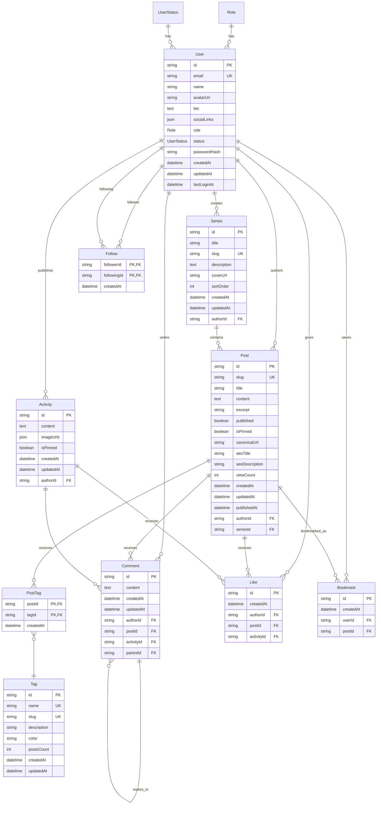
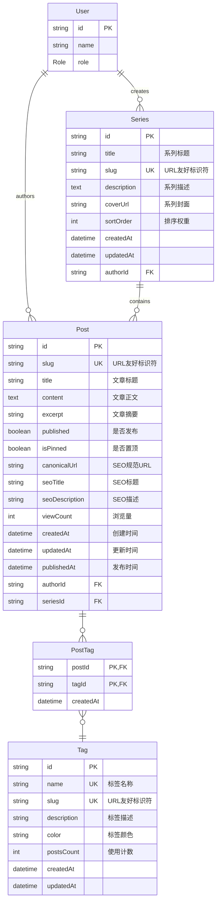
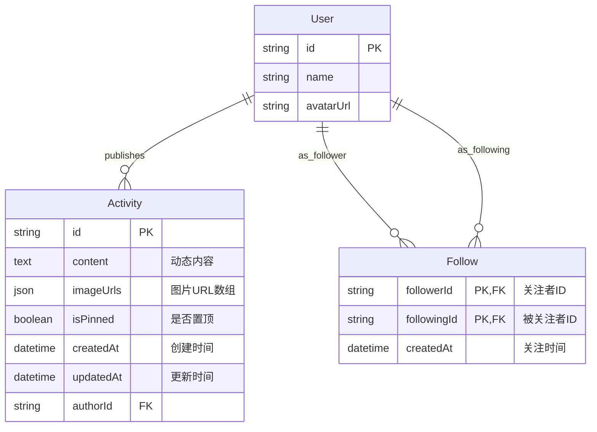
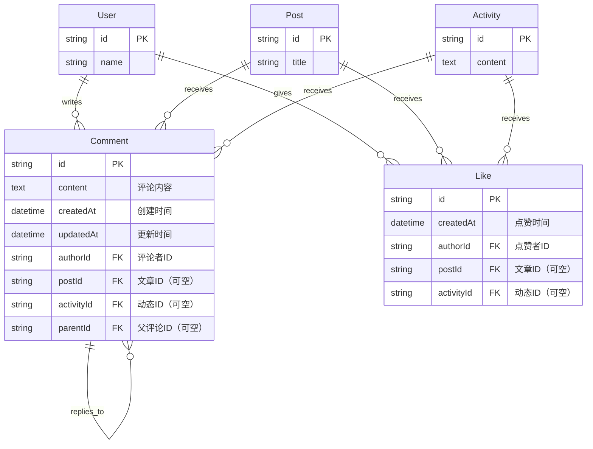
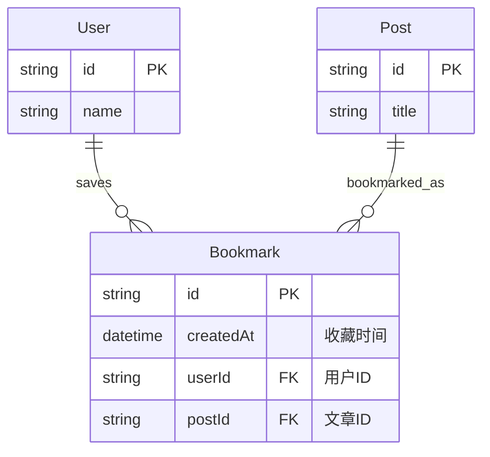
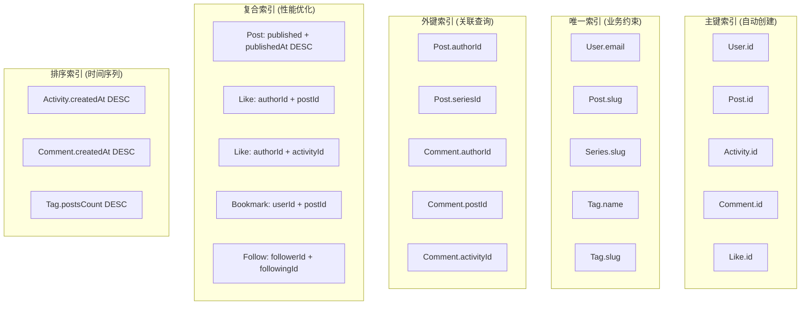
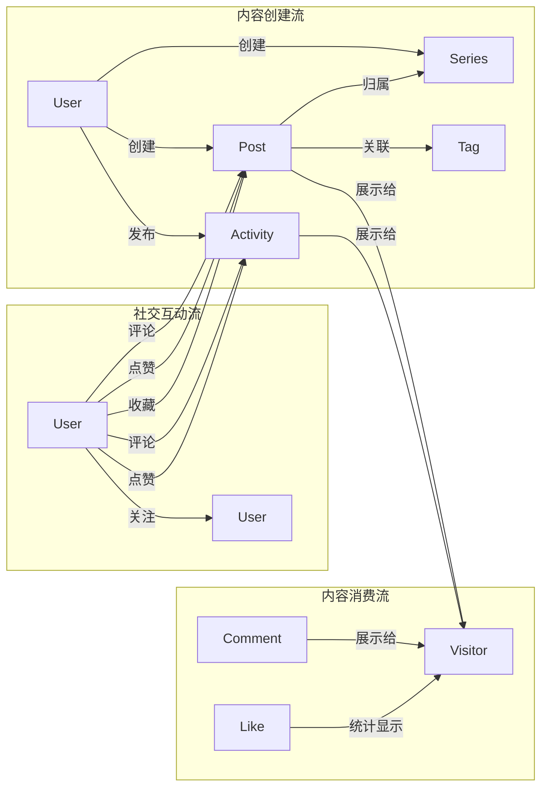
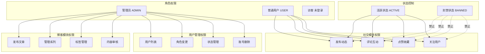

# 现代化博客项目数据库实体关系图

## 完整 ERD 图



## 模块化 ERD 图

### 1. 用户系统模块

```mermaid
erDiagram
    User {
        string id PK
        string email UK "用户邮箱，唯一标识"
        string name "用户昵称"
        string avatarUrl "头像URL"
        text bio "个人简介"
        json socialLinks "社交链接JSON"
        Role role "用户角色：USER|ADMIN"
        UserStatus status "用户状态：ACTIVE|BANNED"
        string passwordHash "密码哈希，OAuth用户为null"
        datetime createdAt "创建时间"
        datetime updatedAt "更新时间"
        datetime lastLoginAt "最后登录时间"
    }

    Role {
        USER "普通用户"
        ADMIN "管理员"
    }

    UserStatus {
        ACTIVE "活跃状态"
        BANNED "封禁状态"
    }

    Role ||--o{ User : has
    UserStatus ||--o{ User : has
```

### 2. 博客模块



### 3. 社交动态模块



### 4. 通用交互模块



### 5. 用户功能模块



## 关系类型说明

### 一对一关系 (1:1)

- 当前架构中无一对一关系
- 未来可扩展：User ↔ UserProfile

### 一对多关系 (1:N)

1. **User → Posts**: 用户（管理员）发布多篇文章
2. **User → Activities**: 用户发布多条动态
3. **User → Series**: 用户创建多个文章系列
4. **User → Comments**: 用户发表多条评论
5. **User → Likes**: 用户给出多个点赞
6. **User → Bookmarks**: 用户收藏多篇文章
7. **Series → Posts**: 系列包含多篇文章
8. **Post → Comments**: 文章收到多条评论
9. **Activity → Comments**: 动态收到多条评论
10. **Comment → Comments**: 评论的嵌套回复

### 多对多关系 (M:N)

1. **Post ↔ Tag**: 文章与标签的多对多关系（通过PostTag中间表）
2. **User ↔ User**: 用户关注关系（通过Follow自引用表）

### 多态关联

1. **Comment**: 既可以评论Post，也可以评论Activity
2. **Like**: 既可以点赞Post，也可以点赞Activity

## 索引设计图



## 数据流向图



## 权限控制图



## 总结

本实体关系图完整展现了现代化博客项目的数据架构：

1. **11个核心模型**：覆盖用户系统、博客管理、社交互动、通用交互等全部业务场景
2. **清晰的模块分离**：博客模块和社交模块独立设计，互不干扰
3. **灵活的关系设计**：支持多态关联、嵌套回复、多对多标签等复杂业务需求
4. **完善的约束机制**：通过唯一索引、外键约束确保数据完整性
5. **性能优化导向**：19个精心设计的索引支持高频查询场景

该架构为项目提供了坚实的数据基础，支持从MVP到大规模应用的平滑演进。
