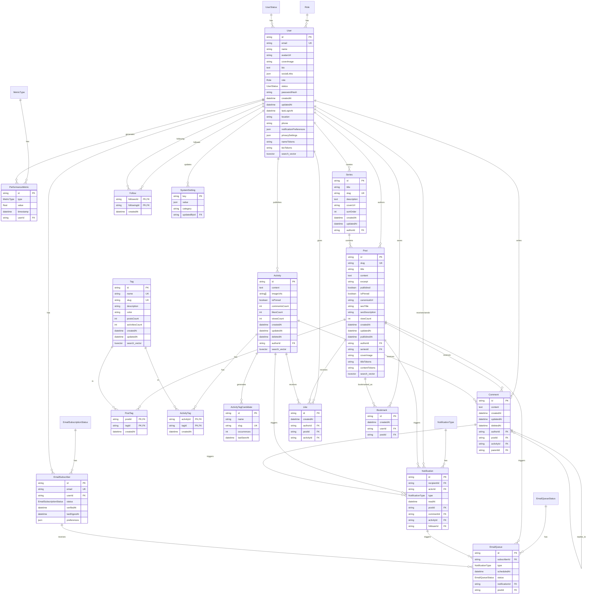
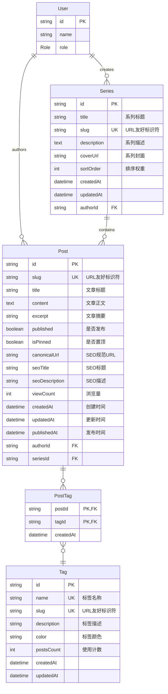
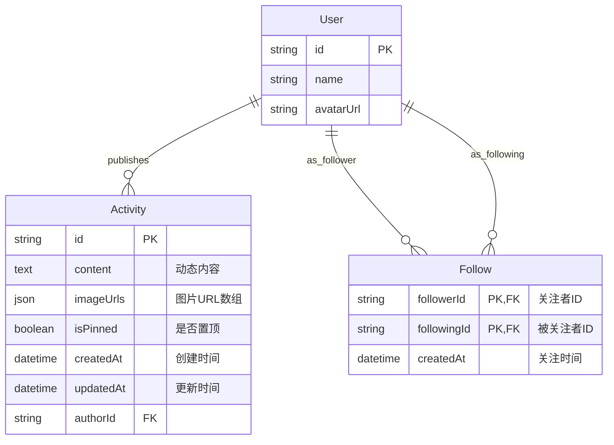
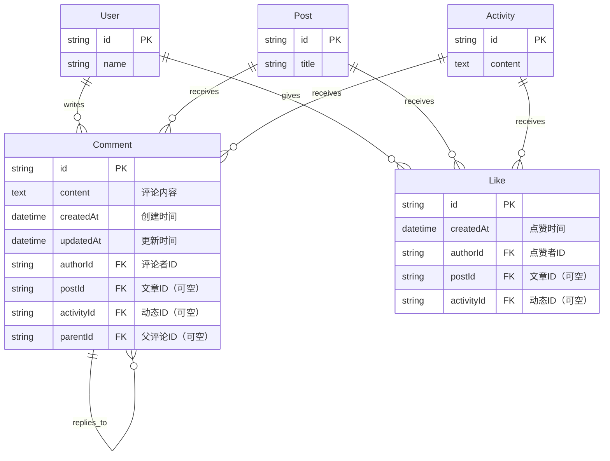
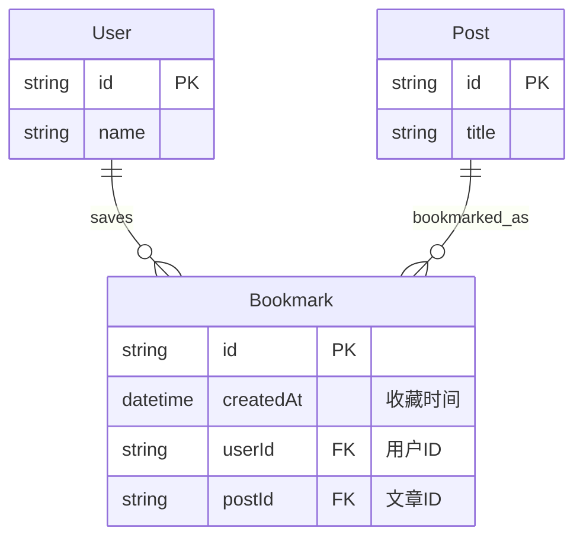
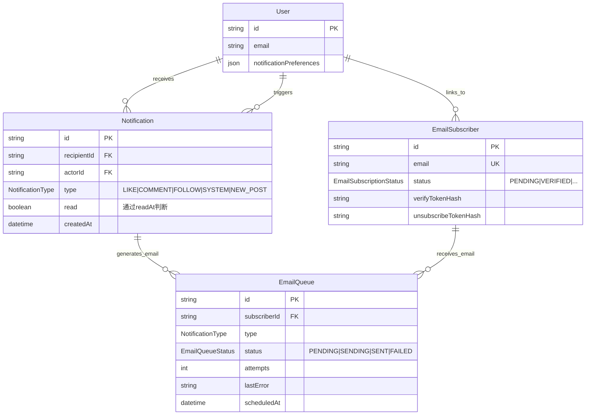
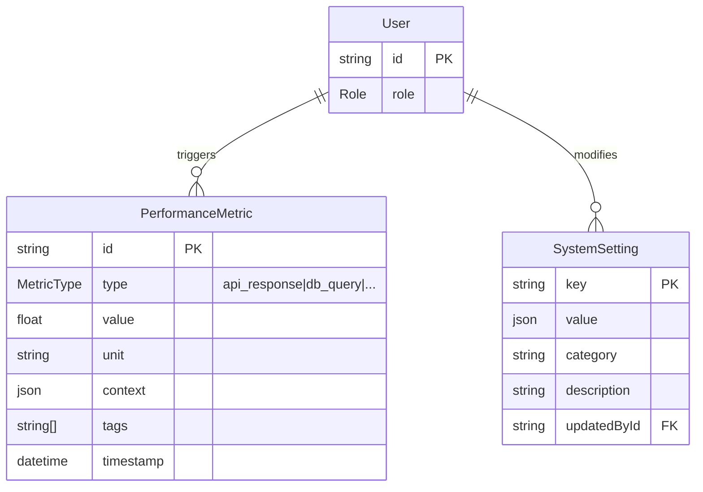
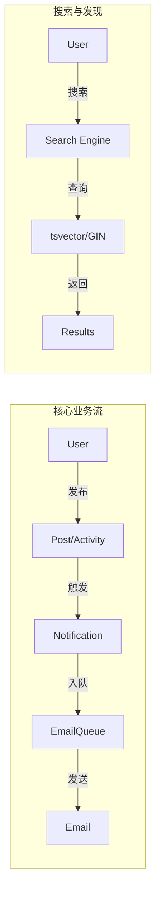

# 现代化博客项目数据库实体关系图

## 完整 ERD 图



## 模块化 ERD 图

### 1. 用户系统模块

```mermaid
erDiagram
    User {
        string id PK
        string email UK "用户邮箱，唯一标识"
        string name "用户昵称"
        string avatarUrl "头像URL"
        text bio "个人简介"
        json socialLinks "社交链接JSON"
        Role role "用户角色：USER|ADMIN"
        UserStatus status "用户状态：ACTIVE|BANNED"
        string passwordHash "密码哈希，OAuth用户为null"
        datetime createdAt "创建时间"
        datetime updatedAt "更新时间"
        datetime lastLoginAt "最后登录时间"
    }

    Role {
        USER "普通用户"
        ADMIN "管理员"
    }

    UserStatus {
        ACTIVE "活跃状态"
        BANNED "封禁状态"
    }

    Role ||--o{ User : has
    UserStatus ||--o{ User : has
```

### 2. 博客模块



### 3. 社交动态模块



### 4. 通用交互模块



### 5. 用户功能模块



### 6. 通知与订阅模块



### 7. 系统监控与设置模块



## 关系类型说明

### 一对一关系 (1:1)

- `User` ↔ `EmailSubscriber` (可选，未登录用户也可以订阅)

### 一对多关系 (1:N)

1. **User → Posts**: 用户（管理员）发布多篇文章
2. **User → Activities**: 用户发布多条动态
3. **User → Series**: 用户创建多个文章系列
4. **User → Comments**: 用户发表多条评论
5. **User → Likes**: 用户给出多个点赞
6. **User → Bookmarks**: 用户收藏多篇文章
7. **Series → Posts**: 系列包含多篇文章
8. **Post → Comments**: 文章收到多条评论
9. **Activity → Comments**: 动态收到多条评论
10. **Comment → Comments**: 评论的嵌套回复
11. **User → Notifications**: 用户接收/触发多条通知
12. **User → PerformanceMetrics**: 用户行为产生多条性能指标
13. **EmailSubscriber → EmailQueue**: 订阅者接收多封邮件

### 多对多关系 (M:N)

1. **Post ↔ Tag**: 文章与标签的多对多关系（通过PostTag中间表）
2. **Activity ↔ Tag**: 动态与标签的多对多关系（通过ActivityTag中间表）
3. **User ↔ User**: 用户关注关系（通过Follow自引用表）

### 多态关联

1. **Comment**: 既可以评论Post，也可以评论Activity
2. **Like**: 既可以点赞Post，也可以点赞Activity
3. **Notification**: 可关联 Post, Comment, Activity, User (Follower)

## 索引设计图

```mermaid
graph TD
    subgraph "主键索引 (自动创建)"
        PK_ALL[所有表的 id]
    end

    subgraph "唯一索引 (业务约束)"
        UK1[User.email]
        UK2[Post.slug]
        UK3[Series.slug]
        UK4[Tag.name]
        UK5[Tag.slug]
        UK6[EmailSubscriber.email]
        UK7[ActivityTagCandidate.slug]
    end

    subgraph "全文检索索引 (GIN)"
        GIN1[Post.search_vector]
        GIN2[Activity.search_vector]
        GIN3[User.search_vector]
        GIN4[Tag.search_vector]
        GIN5[User.name/bio/email (trgm)]
    end

    subgraph "复合索引 (性能优化)"
        CI1[Post: published + publishedAt DESC]
        CI2[Like: authorId + postId/activityId]
        CI3[Bookmark: userId + postId]
        CI4[Follow: followerId + followingId]
        CI5[Notification: recipientId + readAt]
        CI6[EmailQueue: status + scheduledAt]
        CI7[PerformanceMetric: type + timestamp]
    end

    subgraph "排序索引 (时间序列)"
        SI1[Activity.createdAt DESC]
        SI2[Comment.createdAt DESC]
        SI3[Tag.postsCount DESC]
        SI4[ActivityTagCandidate.lastSeenAt]
    end
```

## 数据流向图



## 总结

本实体关系图完整展现了现代化博客项目的数据架构（v4.2）：

1.  **16个核心模型**：新增了通知、邮件订阅、性能监控、系统设置等基础设施模型。
2.  **全文检索支持**：核心内容表（Post, Activity, User, Tag）均集成了 PostgreSQL
    `tsvector` 和 GIN 索引，支持高性能全文搜索。
3.  **完善的通知体系**：支持站内通知和邮件推送的双重触达机制。
4.  **运维监控能力**：内置性能指标采集和动态系统设置，提升系统可维护性。
5.  **性能优化导向**：超过25个精心设计的索引，特别是针对复杂查询和全文检索的优化。

该架构不仅满足了博客和社交的基本需求，还为大规模用户运营、内容分发和系统稳定性提供了坚实的底层支撑。
