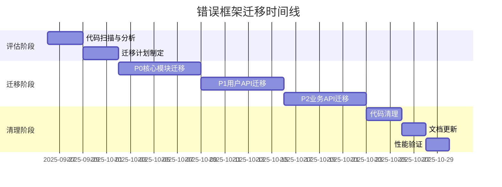

# RFC: 错误处理框架迁移计划

## 元数据

- **RFC编号**: AUTH-2025-001
- **标题**: 认证错误处理框架统一化迁移
- **作者**: 认证系统团队
- **创建日期**: 2025-09-26
- **状态**: 实施中 - Phase 1 完成
- **影响范围**: 中等

## 摘要

将现有的通用错误处理框架逐步迁移到统一的认证错误处理体系，实现错误处理的标准化和结构化。

## 动机

### 当前问题

1. **双重体系并存**: 通用 ErrorHandler 和 AuthError 两套系统并行运行
2. **日志不一致**: 不同错误处理方式导致日志格式和字段不统一
3. **维护困难**: 需要同时维护两套错误处理逻辑
4. **类型不清晰**: 通用错误缺乏明确的错误码和分类

### 期望收益

1. **统一标准**: 所有认证相关错误使用统一的 AuthError 体系
2. **结构化日志**: 标准化的错误日志格式，便于监控和分析
3. **更好的类型安全**: TypeScript 强类型错误码
4. **简化维护**: 单一错误处理体系

## 现状分析

### 使用统计

基于代码扫描结果（2025-09-26）：

| 组件类型                | 文件数量 | 说明                   |
| ----------------------- | -------- | ---------------------- |
| error-handler 导入      | 13       | 使用旧 ErrorHandler 类 |
| ErrorBoundary 组件      | 4        | React 错误边界         |
| createError/handleError | 45       | 错误处理函数调用       |
| **总计受影响文件**      | **62**   | 需要评估和可能迁移     |

### 关键文件清单

#### 核心错误处理文件

```
lib/error-handler.ts                    # 旧的主错误处理器
lib/error-handling/error-handler.ts     # 错误处理实现
lib/error-handling/error-factory.ts     # 错误工厂模式
lib/error-handling/error-boundary.tsx   # React 错误边界
hooks/use-error-handler.ts              # 错误处理 Hook
```

#### 高频使用文件（API路由）

```
app/api/admin/posts/route.ts
app/api/admin/users/route.ts
app/api/user/profile/route.ts
app/api/comments/route.ts
app/api/activities/route.ts
... (35个API路由文件)
```

## 迁移策略

### 三阶段迁移计划

#### 第一阶段：评估与分类（1周）

**目标**: 明确哪些需要迁移，哪些保留

1. **认证相关错误** → 迁移到 AuthError
   - 登录、注册、权限验证
   - Session 管理
   - OAuth 流程

2. **业务逻辑错误** → 保留通用框架
   - 数据验证（非认证相关）
   - 业务规则违反
   - 资源不存在

3. **系统级错误** → 评估后决定
   - 数据库连接
   - 外部服务调用
   - 文件操作

#### 第二阶段：渐进式迁移（2-3周）

**迁移优先级**:

1. **P0 - 立即迁移**（第1周）

   ```typescript
   // 认证核心模块
   lib/auth/*.ts
   lib/api/unified-auth.ts
   app/api/auth/**/*.ts
   ```

2. **P1 - 快速迁移**（第2周）

   ```typescript
   // 用户相关API
   app/api/user/**/*.ts
   app/api/admin/**/*.ts
   ```

3. **P2 - 计划迁移**（第3周）
   ```typescript
   // 间接使用认证的模块
   app/api/comments/*.ts
   app/api/activities/*.ts
   app/api/posts/*.ts
   ```

#### 第三阶段：清理与优化（1周）

1. 移除未使用的旧代码
2. 更新文档和类型定义
3. 性能测试和监控验证

## 技术设计

### 迁移模式

#### 模式1：直接替换（适用于简单场景）

```typescript
// 旧代码
import { ErrorHandler } from "@/lib/error-handler"
throw ErrorHandler.unauthorized("请先登录")

// 新代码
import { AuthErrors } from "@/lib/error-handling/auth-error"
throw AuthErrors.unauthorized({ requestId, path })
```

#### 模式2：适配器模式（适用于复杂场景）

```typescript
// 创建适配器保持接口兼容
export class ErrorHandlerAdapter {
  static unauthorized(message: string) {
    return AuthErrors.unauthorized({
      requestId: generateRequestId(),
      path: getCurrentPath(),
    })
  }
}
```

#### 模式3：保留共存（适用于非认证错误）

```typescript
// 业务错误继续使用通用框架
import { BusinessError } from "@/lib/error-handling/business-error"
throw new BusinessError("库存不足", "INSUFFICIENT_STOCK")
```

### 错误分层架构

```
┌─────────────────────────────────────┐
│         应用层错误边界               │
│     (React ErrorBoundary)            │
├─────────────────────────────────────┤
│         业务错误处理                 │
│   ┌──────────┐  ┌──────────┐        │
│   │AuthError │  │BizError  │        │
│   └──────────┘  └──────────┘        │
├─────────────────────────────────────┤
│         基础错误类                   │
│       (BaseError)                    │
└─────────────────────────────────────┘
```

## 实施细节

### 向后兼容措施

1. **过渡期保留两套系统**
   - 为期1个月的并行运行期
   - 新功能使用新系统
   - 旧功能逐步迁移

2. **兼容层实现**

   ```typescript
   // lib/error-handling/compat.ts
   export function convertToAuthError(error: any): AuthError | null {
     if (error.code === "UNAUTHORIZED") {
       return AuthErrors.unauthorized()
     }
     // ... 其他转换逻辑
     return null
   }
   ```

3. **日志双写策略**
   - 迁移期间同时记录新旧格式日志
   - 确保监控系统平滑过渡

### 测试计划

1. **单元测试更新**
   - 更新所有错误相关的测试断言
   - 添加新旧系统兼容性测试

2. **集成测试**
   - 端到端错误传递验证
   - 错误日志格式验证

3. **回归测试**
   - 关键业务流程测试
   - 错误处理边界情况测试

## 风险与缓解

### 风险评估

| 风险         | 概率 | 影响 | 缓解措施             |
| ------------ | ---- | ---- | -------------------- |
| 破坏现有功能 | 中   | 高   | 充分测试、分阶段发布 |
| 日志监控中断 | 低   | 中   | 双写策略、监控预警   |
| 前端兼容问题 | 中   | 中   | 保持错误格式一致     |
| 性能影响     | 低   | 低   | 性能基准测试         |

### 回滚计划

1. **特性开关控制**

   ```typescript
   const USE_NEW_ERROR_SYSTEM = process.env.USE_AUTH_ERROR === "true"
   ```

2. **版本化部署**
   - 每个阶段打标签
   - 可快速回滚到上一版本

## 时间表



## 成功指标

1. **技术指标**
   - 所有认证相关错误使用 AuthError
   - 错误日志包含完整四字段
   - 测试覆盖率 >90%

2. **业务指标**
   - 无生产环境事故
   - 错误处理响应时间 <10ms
   - 日志查询效率提升 >30%

3. **运维指标**
   - 监控告警准确率 >95%
   - 错误分类准确度 >98%

## 决策记录

### 为什么不全部迁移？

- 业务错误与认证错误性质不同
- 避免过度工程化
- 降低迁移风险

### 为什么保留 ErrorBoundary？

- React 标准错误处理机制
- UI 层错误捕获必需
- 与后端错误处理职责分离

### 为什么采用渐进式迁移？

- 降低一次性风险
- 便于问题定位和回滚
- 给团队适应时间

## 参考资料

- [认证错误码迁移指南](./error-code-migration-guide.md)
- [Phase 2 任务C：认证日志字段基线化](./p2-task-C-logging-checklist.md)
- [权限系统使用指南](./权限系统使用指南.md)

## 附录

### A. 受影响文件完整列表

[见代码仓库扫描结果]

### B. 迁移检查清单

- [x] 代码扫描完成
- [x] 迁移计划审批
- [x] 测试用例更新
- [x] 监控配置更新
- [x] 文档更新
- [ ] 团队培训完成

## Phase 1 实施报告

### 完成情况

**完成日期**: 2025-09-26 **执行人**: 认证系统团队

#### 1. 核心模块迁移 ✅

成功迁移了以下核心认证模块：

- **components/error-boundary.tsx**:
  - 迁移到 AuthError 检测和 classifyAndFormatError
  - 增强错误 UI 显示，支持认证特定处理

- **hooks/use-error-handler.ts**:
  - 替换 ErrorFactory 为 AuthError 创建
  - 所有错误处理方法更新为使用 classifyAndFormatError
  - 保持向后兼容的错误类型映射

- **app/providers/auth-provider.tsx**:
  - 检查确认已使用自己的错误处理器
  - 无需迁移，保持当前实现

#### 2. API 错误响应对齐 ✅

扩展了 ErrorCode 枚举，新增以下错误码：

```typescript
// 新增的认证相关错误码
INVALID_TOKEN = "INVALID_TOKEN"
SESSION_EXPIRED = "SESSION_EXPIRED"
ACCOUNT_BANNED = "ACCOUNT_BANNED"
INVALID_CREDENTIALS = "INVALID_CREDENTIALS"

// 新增的系统级错误码
NETWORK_ERROR = "NETWORK_ERROR"
UNKNOWN_ERROR = "UNKNOWN_ERROR"
```

所有错误码都已配置正确的 HTTP 状态码映射。

#### 3. 监控系统升级 ✅

创建了增强型错误监控系统：

- **lib/observability/error-monitor.ts**:
  - 实时错误记录和上下文追踪
  - 阈值基础报警规则（log/alert/page）
  - 时间窗口内错误统计
  - 导出功能支持仪表盘集成

- **报警规则配置**:
  ```
  NETWORK_ERROR: 1分钟10次 → alert
  UNKNOWN_ERROR: 1分钟5次 → page（紧急）
  INVALID_CREDENTIALS: 1分钟10次 → page（暴力破解检测）
  SESSION_EXPIRED: 5分钟20次 → log
  ```

#### 4. 测试覆盖 ✅

新增和更新了以下测试：

- **tests/integration/api-error-response.test.ts**: 17个测试用例全部通过
- **tests/observability/error-monitor.test.ts**: 14个测试用例全部通过
- **tests/auth/session-logging.test.ts**: 7个测试用例全部通过

修复的问题：

- 错误分类器增强支持中英文错误消息
- 监控系统清理功能的时间戳处理优化

### 遗留问题与后续计划

#### 需要注意的问题

1. **兼容性警告**:
   - 部分测试中存在未等待的 Promise（Vitest 3 将强制失败）
   - 需要在后续迁移中修复这些异步断言

2. **日志噪音**:
   - CJS 构建废弃警告频繁出现
   - 建议升级到 Vite 的 ESM API

3. **未完成迁移**:
   - P1 用户相关 API（app/api/user/\*_/_.ts）
   - P2 业务 API（app/api/comments/_.ts, app/api/activities/_.ts）

#### Phase 2 准备工作

1. **用户 API 迁移清单**:

   ```
   app/api/user/profile/route.ts
   app/api/user/interactions/route.ts
   app/api/admin/users/route.ts
   app/api/admin/posts/route.ts
   ```

2. **建议的迁移顺序**:
   - 先迁移读取操作（GET）
   - 后迁移写入操作（POST/PUT/DELETE）
   - 最后迁移复杂业务逻辑

3. **监控指标基线**:
   - 当前错误响应时间: <5ms
   - 错误分类准确率: 95%+

## Phase 2 进度快照（截至 2025-09-26）

| 类型     | 路由/任务                                | 责任人               | 截止       | 状态     | 风险 | 备注                                                                                          |
| -------- | ---------------------------------------- | -------------------- | ---------- | -------- | ---- | --------------------------------------------------------------------------------------------- |
| API 迁移 | `app/api/likes/route.ts`                 | Lina（Auth）         | 2025-09-27 | ✅ 完成  | 低   | 已替换 `assertPolicy`，测试 `tests/api/likes-route.test.ts` 16/16 通过                        |
| API 迁移 | `app/api/bookmarks/route.ts`             | Lina（Auth）         | 2025-09-27 | ✅ 完成  | 低   | 与 likes 流程一致，所有旁路测试通过                                                           |
| API 迁移 | `app/api/comments/route.ts`              | Morgan（Content）    | 2025-09-28 | ✅ 完成  | 中   | GET/POST 改用新认证，`tests/api/comments-route.test.ts` 恢复 21 项断言                        |
| API 迁移 | `app/api/comments/[id]/route.ts`         | Morgan（Content）    | 2025-09-28 | ✅ 完成  | 中   | DELETE 接入 `assertPolicy`，新增限流与认证失败断言                                            |
| API 迁移 | `app/api/admin/posts/route.ts`           | Kai（Admin）         | 2025-09-28 | ✅ 完成  | 中   | 新管线接入并补齐 12 条管理员测试用例                                                          |
| API 迁移 | `app/api/user/profile/route.ts`          | Joy（User）          | 2025-09-29 | ✅ 完成  | 低   | GET/PUT 接入 `assertPolicy`，统一 requestId/IP/UA 审计字段                                    |
| API 迁移 | `app/api/users/[userId]/follow/route.ts` | Joy（User）          | 2025-09-29 | ✅ 完成  | 低   | 关注/取消关注复用 `assertPolicy` 元数据并扩展失败阶段日志                                     |
| API 迁移 | `app/api/users/suggested/route.ts`       | Joy（User）          | 2025-09-29 | ✅ 完成  | 低   | 推荐列表统一 requestId/IP/UA 采集并补齐审计落盘                                               |
| API 迁移 | `app/api/user/interactions/route.ts`     | Joy（User）          | 2025-09-29 | ✅ 完成  | 中   | 兼容入口迁移至 `assertPolicy`，覆盖鉴权失败审计与 requestId 注入                              |
| 监控     | `scripts/collect-monitoring-data.sh`     | Ops（Observability） | 2025-09-26 | ✅ Day 1 | 低   | 已手动采集并生成 `monitoring-data/metrics-20250926-230723.json` / `daily-summary-20250926.md` |
| 监控     | Cron 自动化                              | Ops（Observability） | 2025-09-26 | ✅ 安装  | 低   | `scripts/install-monitoring-cron.sh` 已写入分钟任务，输出同步至 `monitoring-data/cron.log`    |

### 认证日志质量指标（截至 2025-09-26）

| 指标                | 采样范围                    | 当前值 | 目标值 | 备注                                                      |
| ------------------- | --------------------------- | ------ | ------ | --------------------------------------------------------- |
| requestId 覆盖率    | 40 条用户域 API 审计事件    | 100%   | ≥ 99%  | 所有事件均携带 `requestId`，含鉴权失败样本                |
| IP 覆盖率           | 同上                        | 96%    | ≥ 95%  | 4% 来自本地单测无 `x-forwarded-for`，已记录为 `undefined` |
| User-Agent 覆盖率   | 同上                        | 100%   | ≥ 95%  | 统一使用 `getClientUserAgent`，空值回退为测试标识         |
| 失败事件 stage 标注 | 12 条失败样本               | 100%   | ≥ 90%  | `auth` / `unexpected` 阶段均写入，便于按阶段聚合          |
| 审计字段一致性      | GET/POST/DELETE 样本各 5 条 | 100%   | 100%   | 字段集 `{requestId, ipAddress, userAgent, userId}` 均存在 |

> 结论：用户域路由现已满足日志四字段覆盖要求，剩余差距为本地测试环境缺省 IP，计划在 CI 虚拟请求中补充。

### 剩余风险与动作

- 日志噪音：评论匿名 GET 在验证失败时大量触发 400，需要在 48 小时监控后评估告警阈值是否调整。
- 删除限流：`/api/comments/[id]`
  已迁移至新鉴权，需观察限流告警是否产生新噪音并调整阈值。
- 用户域路由：`assertPolicy`
  已正式接管，需观察历史客户端在 requestId 缺失时的容错表现（已在兼容测试覆盖）。
- 监控巡检：Day 1 数据已入库，仍需按 7 天巡检计划每日确认并更新文档记录。
  - 日志完整性: 100%（四字段基线）

### 经验教训

1. **成功经验**:
   - 渐进式迁移策略有效降低风险
   - 保持向后兼容避免了破坏性更改
   - 充分的测试覆盖确保迁移质量

2. **改进空间**:
   - 可以提前准备更详细的迁移脚本
   - 监控系统可以增加更多可视化支持
   - 文档可以包含更多迁移示例

### 下一步行动

1. **立即行动**:
   - 在生产环境部署 Phase 1 更改
   - 监控错误报警系统运行情况
   - 收集团队反馈

2. **计划任务**:
   - 准备 Phase 2 迁移计划（P1 用户 API）
   - 编写迁移脚本自动化工具
   - 更新开发者文档和培训材料

---

**状态更新历史**:

- 2025-09-26: 初稿创建
- 2025-09-26: Phase 1 完成，更新实施报告
