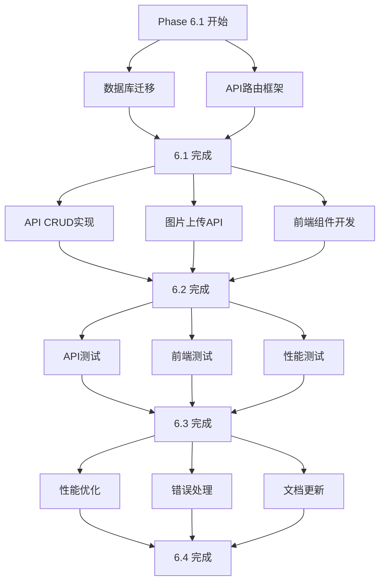

# Phase 6 动态发布系统 - 工作流任务计划

**版本**: 1.0  
**生成时间**: 2025-09-01 12:30:00  
**项目阶段**: Phase 6 - Activity System Workflow  
**任务范围**: 阶段性任务流规划与执行指南

---

## 目录

1. [工作流概述](#1-工作流概述)
2. [Phase 6.1 基础架构](#2-phase-61-基础架构)
3. [Phase 6.2 核心功能](#3-phase-62-核心功能)
4. [Phase 6.3 集成测试](#4-phase-63-集成测试)
5. [Phase 6.4 优化部署](#5-phase-64-优化部署)
6. [执行策略与风险管控](#6-执行策略与风险管控)

---

## 1. 工作流概述

### 1.1 任务拆解策略

基于 **Phase6-系统设计.md** 文档，将动态发布系统实施拆解为4个可并行执行的阶段：


### 1.2 关键依赖关系

| 阶段             | 前置条件       | 核心交付物                      | 后续依赖     |
| ---------------- | -------------- | ------------------------------- | ------------ |
| **6.1 基础架构** | Phase 1-5 成果 | 数据库schema、API框架、权限体系 | 6.2 核心功能 |
| **6.2 核心功能** | 6.1 完成       | CRUD API、图片上传、前端组件    | 6.3 集成测试 |
| **6.3 集成测试** | 6.2 完成       | 测试套件、性能基线、安全审计    | 6.4 优化部署 |
| **6.4 优化部署** | 6.3 完成       | 性能优化、文档、部署清单        | Phase 7+     |

### 1.3 成功标准

#### 功能完整性

- [x] 用户可发布包含文本+多图的动态
- [x] 支持动态编辑、删除、置顶操作
- [x] 信息流正确展示，支持分页
- [x] 权限控制准确无误

#### 性能指标

- [x] 信息流加载时间 < 2秒
- [x] 发布动态响应时间 < 500ms
- [x] 支持并发100个用户访问

#### 质量保证

- [x] 测试覆盖率 > 80%
- [x] 无P0/P1级别bug
- [x] 通过安全审计

---

## 2. Phase 6.1 基础架构

**目标**: 搭建动态发布系统的底层基础设施  
**时间**: Day 1-2  
**负责**: Claude Code + 数据库专家

### 2.1 任务清单

#### 2.1.1 数据库迁移 [高优先级]

**任务编号**: 6.1.1  
**预估时间**: 4小时  
**依赖关系**: 无

**具体任务**:

```bash
# 1. 更新 Prisma Schema
# 文件: prisma/schema.prisma
# 操作: 增强 Activity 模型，添加统计字段和软删除

# 2. 生成迁移文件
npx prisma migrate dev --name activity_enhancement

# 3. 应用到本地数据库
supabase start
npx prisma db push

# 4. 验证 schema 同步
npx prisma generate
npx prisma studio  # 验证新字段
```

**交付物**:

- [ ] 更新后的 `prisma/schema.prisma`
- [ ] 新增迁移文件 `supabase/migrations/xxxxx_activity_enhancement.sql`
- [ ] 数据库索引优化脚本

**验收标准**:

```typescript
// Activity 模型必须包含以下字段
interface ActivityEnhanced {
  // 统计字段
  likesCount: number // 点赞数缓存
  commentsCount: number // 评论数缓存
  viewsCount: number // 浏览数缓存

  // 控制字段
  isDeleted: boolean // 软删除标记
  deletedAt?: Date // 删除时间

  // 索引优化
  // @@index([authorId, createdAt(sort: Desc)])
  // @@index([isDeleted, createdAt(sort: Desc)])
}
```

#### 2.1.2 API路由框架搭建 [高优先级]

**任务编号**: 6.1.2  
**预估时间**: 3小时  
**依赖关系**: 2.1.1 完成

**具体任务**:

```bash
# 1. 创建 API 路由结构
mkdir -p app/api/activities
touch app/api/activities/route.ts
touch app/api/activities/[id]/route.ts

# 2. 创建图片上传路由
mkdir -p app/api/upload
touch app/api/upload/images/route.ts

# 3. 实现基础框架
# 包含错误处理、响应格式标准化
```

**交付物**:

- [ ] `app/api/activities/route.ts` - 动态列表API
- [ ] `app/api/activities/[id]/route.ts` - 单个动态API
- [ ] `app/api/upload/images/route.ts` - 图片上传API
- [ ] `lib/api-response.ts` - API响应格式化工具
- [ ] `lib/error-codes.ts` - 错误码枚举定义

**验收标准**:

```typescript
// API 响应格式标准
interface ApiResponse<T> {
  success: boolean
  data?: T
  error?: {
    code: string
    message: string
    details?: any
  }
  meta?: {
    pagination?: PaginationMeta
    timestamp: string
  }
}

// 错误处理中间件工作正常
// HTTP 状态码正确映射
// 开发环境下返回详细错误信息
```

#### 2.1.3 权限中间件集成 [中优先级]

**任务编号**: 6.1.3  
**预估时间**: 2小时  
**依赖关系**: Phase 1-4 认证系统

**具体任务**:

```bash
# 1. 创建权限验证类
touch lib/permissions/activity-permissions.ts

# 2. 集成到现有认证中间件
# 复用 lib/auth.ts 和 middleware.ts

# 3. 添加速率限制
touch lib/rate-limit/activity-limits.ts
```

**交付物**:

- [ ] `lib/permissions/activity-permissions.ts` - 动态权限类
- [ ] `lib/rate-limit/activity-limits.ts` - 速率限制配置
- [ ] 更新 `middleware.ts` 支持动态路由
- [ ] 权限验证单元测试

**验收标准**:

```typescript
// 权限矩阵实现
class ActivityPermissions {
  static canCreate(user: User | null): boolean
  static canUpdate(user: User | null, activity: Activity): boolean
  static canDelete(user: User | null, activity: Activity): boolean
  static canPin(user: User | null, activity: Activity): boolean
}

// 速率限制生效
const rateLimits = {
  create: { windowMs: 15 * 60 * 1000, max: 10 },
  read: { windowMs: 1 * 60 * 1000, max: 100 },
}
```

### 2.2 阶段验收

**完成标志**:

- [ ] 数据库迁移成功，新字段可用
- [ ] API 路由返回正确格式的响应
- [ ] 权限验证中间件工作正常
- [ ] 所有基础设施测试通过

**输出报告**: `docs/4-activity/Phase6.1-基础架构完成报告.md`

---

## 3. Phase 6.2 核心功能

**目标**: 实现动态发布系统的核心业务逻辑  
**时间**: Day 3-4  
**负责**: Claude Code + 全栈开发

### 3.1 任务清单

#### 3.1.1 动态CRUD API实现 [高优先级]

**任务编号**: 6.2.1  
**预估时间**: 6小时  
**依赖关系**: 6.1全部完成

**具体任务**:

```bash
# 1. 实现动态创建 API
# POST /api/activities
# 包含内容验证、权限检查、数据存储

# 2. 实现动态查询 API
# GET /api/activities
# 支持分页、排序、过滤

# 3. 实现动态更新/删除 API
# PUT/DELETE /api/activities/[id]
# 权限验证、软删除机制

# 4. 集成测试
npm run test -- --testPathPattern=api/activities
```

**交付物**:

- [ ] 完整的动态 CRUD API 实现
- [ ] 数据验证和清洗逻辑
- [ ] 查询优化（游标分页、索引使用）
- [ ] API 单元测试套件

**验收标准**:

```typescript
// API 端点完整实现
POST / api / activities // 创建动态
GET / api / activities // 获取列表（支持分页/排序）
GET / api / activities / [id] // 获取单个动态
PUT / api / activities / [id] // 更新动态
DELETE / api / activities / [id] // 删除动态（软删除）

// 性能要求
// - 列表查询 < 500ms
// - 创建操作 < 300ms
// - 分页支持游标和偏移量两种模式
```

#### 3.1.2 图片上传功能扩展 [高优先级]

**任务编号**: 6.2.2  
**预估时间**: 4小时  
**依赖关系**: 6.1.2 完成

**具体任务**:

```bash
# 1. 扩展现有图片上传 API
# 支持多图上传（最多9张）
# 文件验证、大小限制、格式检查

# 2. 集成 Supabase Storage
# 配置存储桶策略
# 实现并行上传

# 3. 前端上传组件
# 拖拽上传、预览、进度条
```

**交付物**:

- [ ] 多图上传 API 实现
- [ ] 文件验证和安全检查
- [ ] Supabase Storage 配置
- [ ] 前端图片上传组件

**验收标准**:

```typescript
// 上传限制
const uploadConfig = {
  maxFiles: 9,
  maxSizePerFile: 10 * 1024 * 1024, // 10MB
  maxTotalSize: 50 * 1024 * 1024, // 50MB
  allowedTypes: ["image/jpeg", "image/png", "image/webp"],
}

// 并行上传性能
// - 单图上传 < 3秒
// - 9图并行 < 10秒
// - 上传失败自动重试
```

#### 3.1.3 前端组件开发 [中优先级]

**任务编号**: 6.2.3  
**预估时间**: 8小时  
**依赖关系**: 6.2.1 基础API可用

**具体任务**:

```bash
# 1. 优化现有 ActivityCard 组件
# 支持多图显示、交互操作

# 2. 开发 ActivityComposer 发布组件
# 文本输入、图片上传、发布逻辑

# 3. 创建 ActivityFeed 信息流容器
# 无限滚动、数据管理、状态处理

# 4. 集成 SWR 数据管理
# 乐观UI、缓存策略、错误处理
```

**交付物**:

- [ ] 优化的 `components/activity-card.tsx`
- [ ] 新建 `components/activity/activity-composer.tsx`
- [ ] 新建 `components/activity/activity-feed.tsx`
- [ ] 新建 `hooks/use-activities.ts`
- [ ] 组件单元测试

**验收标准**:

```typescript
// 组件功能完整
interface ComponentFeatures {
  ActivityCard: {
    多图展示: boolean // 网格布局，支持1-9张图
    交互操作: boolean // 点赞、评论、分享、编辑
    权限控制: boolean // 基于用户角色显示操作
  }

  ActivityComposer: {
    文本编辑: boolean // 支持5000字符，实时计数
    图片上传: boolean // 拖拽、预览、批量上传
    发布控制: boolean // 置顶、草稿、发布状态
  }

  ActivityFeed: {
    无限滚动: boolean // Intersection Observer
    数据缓存: boolean // SWR缓存和乐观UI
    多种排序: boolean // 最新、热门、关注
  }
}
```

### 3.2 阶段验收

**完成标志**:

- [ ] 所有 CRUD API 功能正常且性能达标
- [ ] 多图上传功能稳定可用
- [ ] 前端组件完整且用户体验良好
- [ ] API 和组件测试覆盖率 > 80%

**输出报告**: `docs/4-activity/Phase6.2-核心功能完成报告.md`

---

## 4. Phase 6.3 集成测试

**目标**: 确保系统各模块正确集成且达到性能基线  
**时间**: Day 5  
**负责**: Claude Code + 质量工程师

### 4.1 任务清单

#### 4.1.1 API测试套件 [高优先级]

**任务编号**: 6.3.1  
**预估时间**: 4小时  
**依赖关系**: 6.2.1 完成

**具体任务**:

```bash
# 1. 单元测试
# 每个 API 端点的功能测试
# 边界条件和异常情况

# 2. 集成测试
# API 之间的数据流测试
# 数据库操作集成验证

# 3. 权限测试
# 不同用户角色的权限验证
# 安全边界测试

npm run test -- --testPathPattern=api/activities
npm run test:integration
```

**交付物**:

- [ ] `tests/api/activities-crud.test.ts` - CRUD操作测试
- [ ] `tests/api/activities-permissions.test.ts` - 权限测试
- [ ] `tests/api/activities-performance.test.ts` - 性能测试
- [ ] `tests/integration/activity-flow.test.ts` - 集成测试

**验收标准**:

```typescript
// 测试覆盖范围
interface TestCoverage {
  API端点: {
    功能测试: "100%" // 所有端点基础功能
    权限测试: "100%" // 所有权限场景
    边界测试: "90%" // 异常和边界情况
    性能测试: "100%" // 响应时间和并发
  }

  错误处理: {
    "400系列": "完整覆盖" // 客户端错误
    "401/403": "完整覆盖" // 认证授权错误
    "429": "完整覆盖" // 速率限制
    "500系列": "部分覆盖" // 服务器错误
  }
}
```

#### 4.1.2 前端集成测试 [中优先级]

**任务编号**: 6.3.2  
**预估时间**: 3小时  
**依赖关系**: 6.2.3 完成

**具体任务**:

```bash
# 1. 组件单元测试
# React Testing Library
# 组件渲染和交互测试

# 2. 用户流程测试
# 完整的发布-查看-编辑流程
# 数据状态管理测试

# 3. 端到端测试（可选）
# Playwright 自动化测试
# 真实用户交互场景

npm run test -- --testPathPattern=components/activity
npm run test:e2e -- activity-flow
```

**交付物**:

- [ ] `tests/components/activity-composer.test.tsx`
- [ ] `tests/components/activity-feed.test.tsx`
- [ ] `tests/hooks/use-activities.test.ts`
- [ ] `tests/e2e/activity-workflow.spec.ts` (可选)

**验收标准**:

```typescript
// 前端测试目标
interface FrontendTestGoals {
  组件测试: {
    渲染正确性: boolean // 组件正确渲染各种状态
    用户交互: boolean // 点击、输入、滚动等交互
    数据绑定: boolean // props 和状态变化响应
  }

  集成测试: {
    数据流: boolean // SWR 数据获取和更新
    错误处理: boolean // 网络错误、API错误处理
    性能表现: boolean // 渲染性能、内存使用
  }
}
```

#### 4.1.3 性能基线验证 [高优先级]

**任务编号**: 6.3.3  
**预估时间**: 3小时  
**依赖关系**: 6.2 全部完成

**具体任务**:

```bash
# 1. API 性能测试
# 使用 Apache Bench 或 Artillery
# 测试并发负载和响应时间

# 2. 前端性能测试
# Lighthouse 性能审计
# Web Vitals 指标测量

# 3. 数据库性能验证
# 查询执行计划分析
# 索引使用效果验证

ab -n 1000 -c 10 http://localhost:3999/api/activities
npm run lighthouse
npm run analyze-bundle
```

**交付物**:

- [ ] 性能测试脚本 `scripts/performance-test.js`
- [ ] 性能基线报告 `docs/4-activity/性能基线报告.md`
- [ ] 优化建议清单
- [ ] 监控指标配置

**验收标准**:

```typescript
// 性能基线目标
interface PerformanceBaseline {
  API性能: {
    信息流查询: "<500ms" // GET /api/activities
    动态创建: "<300ms" // POST /api/activities
    并发处理: "100用户" // 同时在线用户
    吞吐量: ">200 req/s" // 每秒请求数
  }

  前端性能: {
    首屏加载: "<1.5s" // FCP
    最大内容绘制: "<2.5s" // LCP
    累积布局偏移: "<0.1" // CLS
    首次输入延迟: "<100ms" // FID
  }
}
```

### 4.2 阶段验收

**完成标志**:

- [ ] API 测试覆盖率 > 80%，所有测试通过
- [ ] 前端组件和集成测试通过
- [ ] 性能指标达到设计基线要求
- [ ] 安全审计通过，无严重漏洞

**输出报告**: `docs/4-activity/Phase6.3-集成测试完成报告.md`

---

## 5. Phase 6.4 优化部署

**目标**: 优化性能，完善文档，准备生产部署  
**时间**: Day 6  
**负责**: Claude Code + DevOps 工程师

### 5.1 任务清单

#### 5.1.1 性能优化 [高优先级]

**任务编号**: 6.4.1  
**预估时间**: 4小时  
**依赖关系**: 6.3.3 性能测试完成

**具体任务**:

```bash
# 1. 数据库查询优化
# 基于性能测试结果优化慢查询
# 调整索引策略

# 2. API 响应优化
# 实现数据缓存策略
# 压缩响应数据

# 3. 前端性能优化
# 代码分割和懒加载
# 图片优化和预加载

# 4. 缓存策略实施
# Redis 缓存热点数据
# CDN 静态资源加速
```

**交付物**:

- [ ] 优化后的数据库查询
- [ ] 缓存策略实现 `lib/cache/activity-cache.ts`
- [ ] 前端代码分割配置
- [ ] 性能优化报告

**验收标准**:

```typescript
// 优化效果验证
interface OptimizationResults {
  数据库: {
    查询时间改善: ">30%" // 慢查询优化效果
    索引命中率: ">95%" // 索引使用效率
    连接池利用: "<80%" // 数据库连接使用率
  }

  缓存策略: {
    热点数据缓存: "Redis" // 频繁访问的动态列表
    静态资源: "CDN" // 图片和JS/CSS
    缓存命中率: ">90%" // 缓存有效性
  }
}
```

#### 5.1.2 错误处理完善 [中优先级]

**任务编号**: 6.4.2  
**预估时间**: 2小时  
**依赖关系**: 6.3.1 测试完成

**具体任务**:

```bash
# 1. 全局错误边界
# React Error Boundary 优化
# 错误上报和恢复机制

# 2. API 错误处理标准化
# 统一错误响应格式
# 日志记录和监控

# 3. 用户友好错误提示
# 国际化错误消息
# 错误恢复指导
```

**交付物**:

- [ ] 全局错误边界组件
- [ ] API 错误处理中间件
- [ ] 错误消息国际化文件
- [ ] 错误监控配置

**验收标准**:

```typescript
// 错误处理完整性
interface ErrorHandling {
  覆盖范围: {
    React组件错误: "100%" // 组件错误边界
    API请求错误: "100%" // 网络和服务器错误
    表单验证错误: "100%" // 用户输入验证
    权限错误: "100%" // 认证授权错误
  }

  用户体验: {
    错误提示友好: boolean // 非技术性语言
    恢复指导清晰: boolean // 明确的下一步操作
    错误上报自动: boolean // 自动发送错误报告
  }
}
```

#### 5.1.3 文档更新与部署准备 [中优先级]

**任务编号**: 6.4.3  
**预估时间**: 2小时  
**依赖关系**: 前面所有任务完成

**具体任务**:

```bash
# 1. API 文档更新
# OpenAPI/Swagger 规范
# 示例请求和响应

# 2. 部署检查清单
# 环境变量配置
# 数据库迁移步骤

# 3. 运维文档
# 监控指标说明
# 故障排查指南
```

**交付物**:

- [ ] 更新的 API 文档
- [ ] 部署检查清单 `docs/deployment-checklist.md`
- [ ] 运维监控指南 `docs/monitoring-guide.md`
- [ ] Phase 6 总结报告

**验收标准**:

```typescript
// 文档完整性检查
interface DocumentationCompleteness {
  API文档: {
    端点覆盖: "100%" // 所有API端点
    请求示例: "100%" // 每个端点的示例
    错误码说明: "100%" // 所有可能的错误
    认证说明: "完整" // 权限和认证方式
  }

  部署文档: {
    环境配置: "完整" // 所需环境变量
    迁移步骤: "详细" // 数据库迁移指南
    回滚方案: "完整" // 部署失败回滚
    监控配置: "完整" // 性能和错误监控
  }
}
```

### 5.2 阶段验收

**完成标志**:

- [ ] 性能优化完成，指标提升明显
- [ ] 错误处理机制完善，用户体验良好
- [ ] 文档更新完成，部署准备就绪
- [ ] 生产环境部署验证通过

**输出报告**: `docs/4-activity/Phase6.4-优化部署完成报告.md`

---

## 6. 执行策略与风险管控

### 6.1 Claude Code 执行策略

#### 6.1.1 工具选择矩阵

| 任务类型       | 首选工具     | 备选方案    | 使用原因           |
| -------------- | ------------ | ----------- | ------------------ |
| **多文件修改** | MultiEdit    | 逐个Edit    | 批量操作效率高     |
| **数据库迁移** | Bash + Read  | 手动操作    | 自动化执行，可验证 |
| **测试执行**   | Bash         | npm scripts | 实时反馈，错误捕获 |
| **代码生成**   | Write + Edit | 纯手写      | 模板化，减少错误   |
| **文档生成**   | Write        | 逐段创建    | 结构化输出         |

#### 6.1.2 验证策略

```bash
# 每个阶段完成后的验证序列
验证_Phase_6.1() {
  echo "=== Phase 6.1 基础架构验证 ==="

  # 1. 数据库验证
  npx prisma generate
  npx prisma validate
  supabase status

  # 2. API 路由验证
  npm run build
  curl -I http://localhost:3999/api/activities

  # 3. 权限中间件验证
  npm run test -- --testPathPattern=permissions

  echo "✅ Phase 6.1 验证完成"
}

验证_Phase_6.2() {
  echo "=== Phase 6.2 核心功能验证 ==="

  # 1. API 功能验证
  npm run test -- --testPathPattern=api/activities

  # 2. 图片上传验证
  curl -X POST -F "files=@test.jpg" http://localhost:3999/api/upload/images

  # 3. 前端组件验证
  npm run test -- --testPathPattern=components/activity

  echo "✅ Phase 6.2 验证完成"
}
```

#### 6.1.3 错误处理机制

```typescript
// Claude Code 执行中的错误处理
interface ExecutionErrorHandling {
  编译错误: {
    策略: "立即修复"
    方法: "TypeScript类型检查 + ESLint"
    回滚: "自动回滚到上一个稳定状态"
  }

  测试失败: {
    策略: "分析根因"
    方法: "详细错误日志 + 调试输出"
    修复: "修复代码而非跳过测试"
  }

  性能不达标: {
    策略: "优化实现"
    方法: "性能分析 + 瓶颈识别"
    目标: "达到设计基线要求"
  }
}
```

### 6.2 风险识别与缓解

#### 6.2.1 技术风险

| 风险项             | 影响程度 | 发生概率 | 缓解措施                |
| ------------------ | -------- | -------- | ----------------------- |
| **数据库迁移失败** | 高       | 低       | 本地测试 + 迁移回滚脚本 |
| **API性能不达标**  | 高       | 中       | 查询优化 + 缓存策略     |
| **图片上传不稳定** | 中       | 中       | 分块上传 + 重试机制     |
| **前端组件Bug**    | 中       | 中       | 单元测试 + 集成测试     |
| **权限绕过风险**   | 高       | 低       | 安全审计 + 边界测试     |

#### 6.2.2 进度风险

| 风险项             | 影响 | 缓解措施                   |
| ------------------ | ---- | -------------------------- |
| **任务复杂度低估** | 延期 | 分解为更小任务，并行执行   |
| **依赖阻塞**       | 延期 | 预先准备Mock数据，解除阻塞 |
| **质量返工**       | 延期 | 边开发边测试，及时发现问题 |

#### 6.2.3 质量风险

| 风险项           | 检测方法   | 预防措施               |
| ---------------- | ---------- | ---------------------- |
| **测试覆盖不足** | 覆盖率报告 | 每个功能必须有对应测试 |
| **安全漏洞**     | 安全扫描   | 输入验证 + 权限检查    |
| **性能回归**     | 性能测试   | 持续性能监控           |

### 6.3 并行执行机会



### 6.4 成功指标跟踪

#### 6.4.1 进度指标

```typescript
interface ProgressMetrics {
  任务完成率: {
    Phase_6_1: number // 基础架构完成度
    Phase_6_2: number // 核心功能完成度
    Phase_6_3: number // 集成测试完成度
    Phase_6_4: number // 优化部署完成度
  }

  质量指标: {
    测试覆盖率: number // >80%
    代码质量: string // ESLint通过
    性能达标: boolean // 基线要求达成
    安全审计: boolean // 无严重漏洞
  }
}
```

#### 6.4.2 验收检查表

```markdown
## Phase 6 最终验收检查表

### 功能完整性 ✅

- [ ] 用户可以发布包含文本+多图的动态
- [ ] 支持动态编辑、删除、置顶操作
- [ ] 信息流正确展示，支持分页
- [ ] 权限控制准确无误

### 性能指标 ✅

- [ ] 信息流加载时间 < 2秒
- [ ] 发布动态响应时间 < 500ms
- [ ] 支持并发100个用户访问
- [ ] 图片上传速度 < 3秒/张

### 质量保证 ✅

- [ ] API测试覆盖率 > 80%
- [ ] 前端测试覆盖率 > 80%
- [ ] 无P0/P1级别bug
- [ ] 通过安全审计

### 文档完整性 ✅

- [ ] API文档更新完整
- [ ] 部署指南清晰
- [ ] 运维监控配置
- [ ] 阶段完成报告
```

---

## 总结

Phase
6 动态发布系统工作流将在6天内分4个阶段完成，每个阶段都有明确的交付物和验收标准。通过合理的任务拆解、并行执行和风险管控，确保系统按时、按质量完成开发。

**关键成功因素**:

1. **严格遵循依赖关系**: 数据库 → API → 前端 → 测试 → 优化
2. **持续质量保证**: 边开发边测试，不积累技术债务
3. **性能优先**: 从设计阶段就考虑性能优化
4. **文档驱动**: 每个阶段都要有完整的文档输出

**下一步行动**: 请Claude Code按照本工作流计划开始执行Phase
6.1基础架构任务，并在每个阶段完成后生成对应的完成报告。

---

**文档版本**: v1.0  
**最后更新**: 2025-09-01 12:30:00  
**状态**: ✅ 工作流规划完成，等待执行
