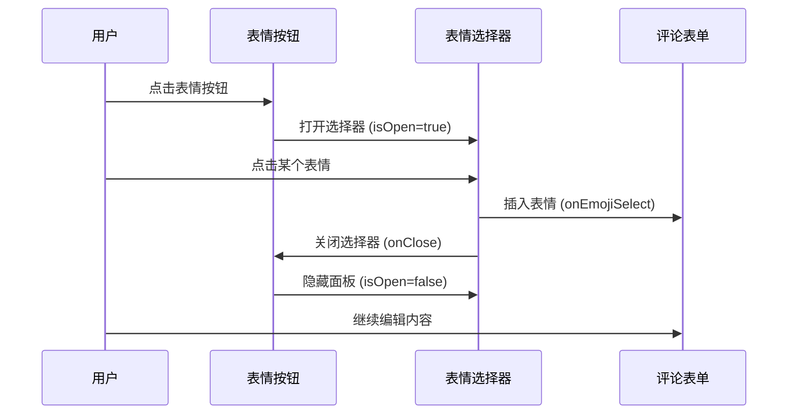

# 表情选择器自动关闭功能文档

## 🎯 功能概述

在用户选择表情后，表情选择器会自动关闭，提供更流畅的用户体验。用户不需要手动关闭表情面板，可以立即看到插入的表情并继续编辑评论。

## ✨ 功能特性

### 📱 **用户体验优化**
- ✅ **一键选择** - 点击表情后立即关闭选择器
- ✅ **视觉清晰** - 避免表情面板遮挡输入框
- ✅ **操作流畅** - 减少不必要的手动关闭步骤
- ✅ **专注编辑** - 选择后可立即继续输入文字

### 🔄 **交互流程**
```
1. 用户点击表情按钮 → 打开表情选择器
2. 用户点击某个表情 → 表情插入到输入框 + 自动关闭选择器
3. 用户继续编辑内容 → 可以看到完整的输入框
4. 用户手动发送评论 → 完成评论发布
```

## 🔧 技术实现

### 核心修改

在 `components/EmojiPicker.tsx` 中修改 `handleEmojiClick` 函数：

```tsx
// 修改前
const handleEmojiClick = (emoji: string) => {
  onEmojiSelect(emoji)
  // 不自动关闭，让用户可以连续选择表情
}

// 修改后
const handleEmojiClick = (emoji: string) => {
  onEmojiSelect(emoji)
  // 选择表情后自动关闭选择器
  onClose()
}
```

### 实现原理

1. **表情选择** - `onEmojiSelect(emoji)` 将表情插入到输入框
2. **自动关闭** - `onClose()` 关闭表情选择器面板
3. **状态同步** - 父组件的 `showEmojiPicker` 状态更新为 `false`

### 组件交互流程



## 🎨 用户体验对比

### 修改前的体验

```
1. 点击表情按钮 → 打开选择器
2. 选择表情 → 表情插入，选择器仍然打开
3. 手动点击关闭按钮 → 关闭选择器
4. 继续编辑内容
```

**问题**：
- ❌ 需要额外的关闭操作
- ❌ 表情面板可能遮挡输入框
- ❌ 操作步骤冗余

### 修改后的体验

```
1. 点击表情按钮 → 打开选择器
2. 选择表情 → 表情插入 + 自动关闭选择器
3. 继续编辑内容
```

**优势**：
- ✅ 操作更简洁
- ✅ 视觉更清晰
- ✅ 流程更流畅

## 📱 移动端适配

### 触摸设备优化

在移动设备上，自动关闭功能特别有用：

1. **屏幕空间** - 小屏幕上表情面板占用较多空间
2. **触摸操作** - 减少额外的触摸步骤
3. **视觉焦点** - 选择后立即看到输入框内容

### 响应式行为

```css
/* 移动端表情选择器样式 */
@media (max-width: 768px) {
  .emoji-picker {
    width: 90vw;
    max-width: 320px;
  }
}
```

## 🔄 替代方案考虑

### 方案对比

#### 1. 当前方案：自动关闭
```tsx
const handleEmojiClick = (emoji: string) => {
  onEmojiSelect(emoji)
  onClose()  // 立即关闭
}
```

**优点**：
- ✅ 操作简洁
- ✅ 视觉清晰
- ✅ 符合大多数用户预期

**缺点**：
- ❌ 无法连续选择多个表情

#### 2. 延迟关闭
```tsx
const handleEmojiClick = (emoji: string) => {
  onEmojiSelect(emoji)
  setTimeout(() => onClose(), 500)  // 延迟关闭
}
```

**优点**：
- ✅ 给用户反馈时间
- ✅ 可以快速选择多个表情

**缺点**：
- ❌ 延迟可能让用户困惑
- ❌ 时间难以把握

#### 3. 配置选项
```tsx
interface EmojiPickerProps {
  autoClose?: boolean  // 可配置是否自动关闭
  // ...其他属性
}
```

**优点**：
- ✅ 灵活性高
- ✅ 可以适应不同场景

**缺点**：
- ❌ 增加复杂性
- ❌ 当前场景不需要这种灵活性

### 选择理由

选择**自动关闭**方案的原因：

1. **用户习惯** - 大多数应用的表情选择器都是选择后自动关闭
2. **使用场景** - 评论系统中，用户通常选择一个表情后继续输入文字
3. **简洁性** - 减少不必要的操作步骤
4. **视觉体验** - 避免面板遮挡输入内容

## 🧪 测试场景

### 功能测试

1. **基本功能**
   - 点击表情按钮打开选择器
   - 选择表情后自动关闭
   - 表情正确插入到输入框

2. **交互测试**
   - 选择不同分类的表情
   - 在不同光标位置插入表情
   - 连续打开和选择表情

3. **边界测试**
   - 快速连续点击表情
   - 在表情选择器打开时点击外部区域
   - 使用键盘 ESC 键关闭

### 用户体验测试

1. **流畅性** - 操作是否流畅自然
2. **直观性** - 行为是否符合用户预期
3. **效率性** - 是否减少了操作步骤

## 🔮 未来扩展

### 可能的增强功能

1. **最近使用表情**
   ```tsx
   // 记录用户最近使用的表情
   const [recentEmojis, setRecentEmojis] = useState<string[]>([])
   
   const handleEmojiClick = (emoji: string) => {
     onEmojiSelect(emoji)
     // 添加到最近使用
     setRecentEmojis(prev => [emoji, ...prev.filter(e => e !== emoji)].slice(0, 8))
     onClose()
   }
   ```

2. **表情搜索功能**
   ```tsx
   // 添加搜索框
   const [searchTerm, setSearchTerm] = useState('')
   const filteredEmojis = emojiData[activeCategory].filter(emoji => 
     emoji.includes(searchTerm) || getEmojiDescription(emoji).includes(searchTerm)
   )
   ```

3. **自定义表情**
   ```tsx
   // 支持用户上传自定义表情
   interface CustomEmoji {
     id: string
     url: string
     name: string
   }
   ```

4. **表情快捷键**
   ```tsx
   // 支持键盘快捷键选择表情
   useEffect(() => {
     const handleKeyPress = (e: KeyboardEvent) => {
       if (e.ctrlKey && e.key >= '1' && e.key <= '9') {
         const index = parseInt(e.key) - 1
         const emoji = emojiData[activeCategory][index]
         if (emoji) handleEmojiClick(emoji)
       }
     }
     // ...
   }, [])
   ```

## 📊 性能考虑

### 渲染优化

```tsx
// 使用 React.memo 优化表情按钮渲染
const EmojiButton = React.memo(({ emoji, onClick }: {
  emoji: string
  onClick: (emoji: string) => void
}) => (
  <button
    type="button"
    onClick={() => onClick(emoji)}
    className="p-2 text-lg hover:bg-gray-100 dark:hover:bg-gray-700 rounded transition-colors"
  >
    {emoji}
  </button>
))
```

### 事件处理优化

```tsx
// 使用 useCallback 优化事件处理函数
const handleEmojiClick = useCallback((emoji: string) => {
  onEmojiSelect(emoji)
  onClose()
}, [onEmojiSelect, onClose])
```

## 📚 相关文档

- [表情选择器组件文档](./EMOJI_PICKER_COMPONENT.md)
- [评论系统文档](./COMMENTS_SETUP.md)
- [用户体验设计指南](./UX_DESIGN_GUIDE.md)
- [表情自动发送修复](./EMOJI_AUTO_SUBMIT_FIX.md)

## 🔄 更新日志

### 2025-06-26
- ✅ 实现表情选择后自动关闭功能
- ✅ 优化用户交互体验
- ✅ 更新相关文档
- ✅ 验证功能正常工作

## 🎯 总结

通过在表情选择后自动关闭选择器，我们显著改善了用户体验：

1. **操作更简洁** - 减少了手动关闭的步骤
2. **视觉更清晰** - 避免面板遮挡输入内容
3. **流程更流畅** - 符合用户的自然操作习惯
4. **移动端友好** - 特别适合小屏幕设备

这个改进让评论系统的表情功能更加用户友好，提升了整体的交互体验。
